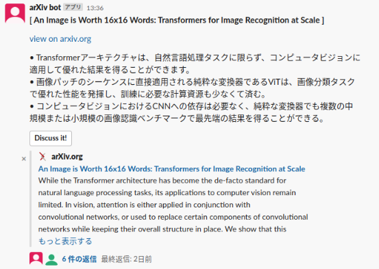
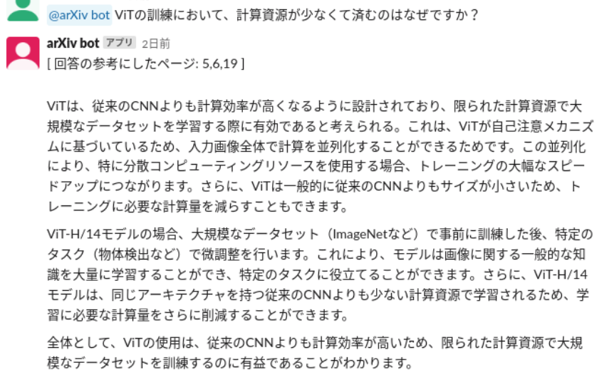
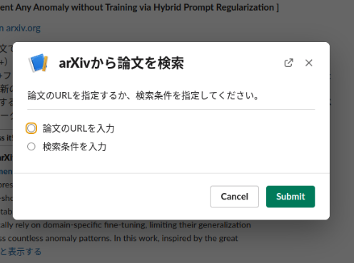
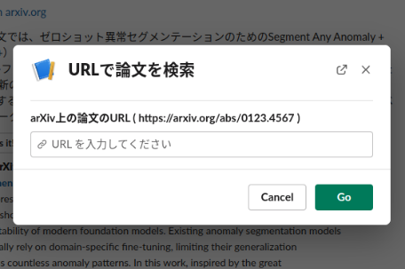
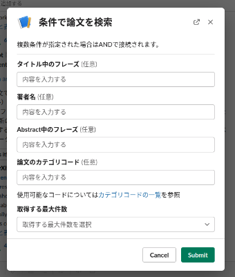

# arxiv-slack-bot

arXivに投稿されている論文のAbstractを要約しSlackに投稿するBot

## Overview

arXiv上の論文のAbstractをさらに要約して3点にまとめ、箇条書きの形でSlackに投稿します。LLMとしてFastChatの[Vicuna](https://github.com/lm-sys/FastChat#model-weights)を使用します。Vicunaは英語で入出力することでより高い性能を発揮するため、ユーザに対して日本語で応答する際にはDeepL APIを用いて翻訳を行っています。

また、各論文の3点要約メッセージに付加されている `Discuss it!` ボタンをクリックすることで、当該メッセージのスレッド内でその論文についてLLMと対話することができます。この機能には高性能なLLMが必要です。Vicuna-13B以上のパラメタ数のモデルの使用を推奨します。

## Functions

### ユーザがコマンドで論文を指定することによる要約機能

1. Botが参加しているSlackチャンネル内でユーザが `/searchnow` コマンドを実行すると、論文の検索方法を選択するためのモーダルが開きます。 
</img>

2. 1.で選択した方法に応じて検索条件を入力し、送信することで論文の要約が投稿されます。 
</img>
</img>

### ユーザが保存した検索条件によって定期的に新着論文を要約して投稿する機能

実装中

## Setup

### configの調整

CUDAが利用可能であり、お使いのGPUのVRAMがVicunaの動作に十分であることを確認してください。設定は `config.py` の内部で行います。設定の意味は以下のとおりです。

- SENTENCE_TRANSFORMER_DEVICE: 対話機能に利用するSentenceTransformerを動かすGPUの指定
- HUGGING_FACE_DEVICE_MAP: LLMを動かす際のGPUの割り当て方の指定
- INITIAL_QUERY: Botの起動時に指定する検索クエリ（定期投稿用）
- LLM_MODEL_NAME_OR_MODEL_PATH: ローカルLLMへのパス
- LOAD_IN_16BIT: モデルを16bitに量子化して読み込むかどうか
- VECTOR_DB_SAVE_DIR: 対話機能用のべクトルデータベースの保存ディレクトリ
- CHAT_HISTORY_SAVE_DIR: 対話機能用の対話履歴の保存ディレクトリ

### Slack Botの設定

Slack API Develper Portalにログインし、新規アプリを作成してください。その後、以下の設定を行ってください。

- Socket Mode画面でSocket Modeをオンにしてください。
- Event Subscription画面で以下のイベントを購読してください。
  - app_mention
  - message.channels
- OAuth&Permissions画面で以下のパーミッションを与えてください。
  - app_mentions:read
  - channels:history
  - chat:write
  - commands
- Slash Commands画面で以下のコマンドを追加してください。
  - `/searchnow`

### APIトークンの設定

`.env.template` を `.env` にリネームし、各種APIトークンを記入してください。

## Launch

`poetry install` によって実行環境を用意し、仮想環境をアクティベートした状態でプロジェクトディレクトリ直下にて `python arxiv-slack-bot/app.py` を実行してください。